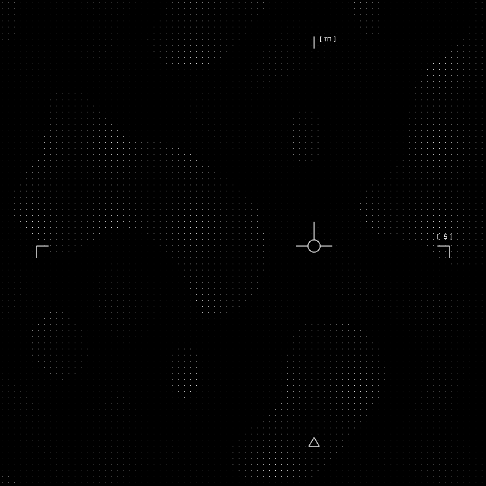

# Watcher - A Video Game POC

This is a small proof of concept I worked on for an ascii art-style game where you are a satellite operator. I suppose it exists as a small art piece for now.

It uses [stb's perlin noise library](https://github.com/nothings/stb/tree/master) for map generation, roughly following the style of [Red Blob Games' Making Maps with Noise Functions](https://www.redblobgames.com/maps/terrain-from-noise/).
