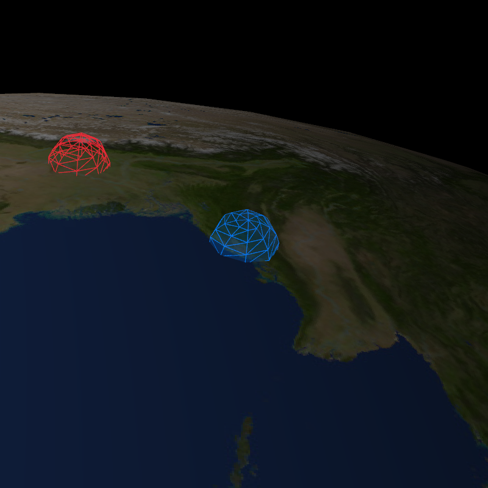

# Satellite

A fun experiment based on a game idea: You are a satellite operator listening in on peoples' conversations.



I wanted a semi-realistic satellite height, and a semi-realistic spin of the earth, so I went with 2000km (somewhere between Low Earth Orbit and Medium Earth Oribt satellites) with a few levels of zoom, and matched the earth's rotation accordingly. It ends up being a lot faster than I thought, but seems pretty realistic overall.

You can click around to track around the earth, and zoom in and out - that's about as far as I got with this one (for now...).

## Usage

```bash
git submodule update --init --recursive
make all
./satellite
```

## Key Bindings

- `LeftMouse` - Select a new target to focus on earth
- `[]` - Zoom in/out
- `\` - Toggle debug mode
- `wasd` - Move around in debug mode
